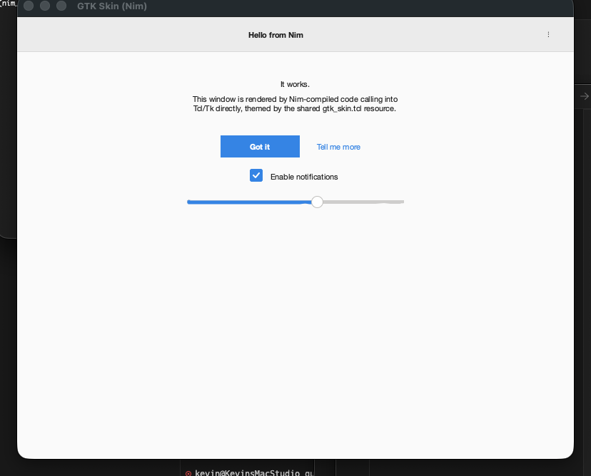
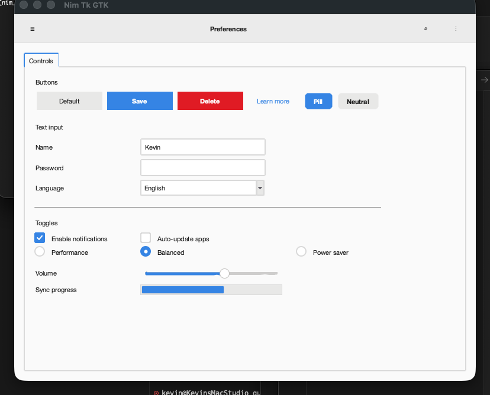
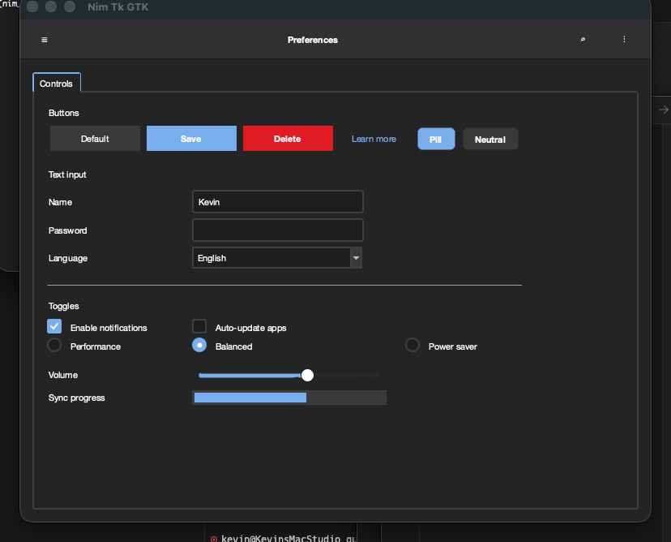
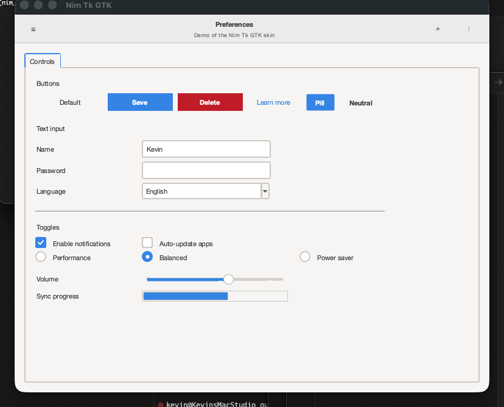

# nim_tk_gtk3_gtk4 — Nim bindings for Tcl/Tk with a GTK3/GTK4 skin

Minimal, direct FFI bindings from [Nim](https://nim-lang.org) to Tcl 8.6 + Tk 8.6, plus a shared Tcl skin that makes the resulting windows look like modern GTK apps.

No third-party Nim packages required. No `PyGObject`, no `wish` subprocess, no IPC. Your Nim program embeds a Tcl/Tk interpreter in-process, evaluates Tcl scripts, and registers Nim procs as Tcl commands for bidirectional calls.

<p align="center">
  
  
</p>

<p align="center">
  
  
</p>

## Features

- **Raw FFI** to `libtcl8.6` / `libtk8.6` — interpreter lifecycle, `Tcl_Eval`, `Tcl_GetString`, `Tcl_CreateObjCommand`, `Tk_MainLoop`.
- **High-level `App` type** that handles interpreter setup, raises Nim exceptions on Tcl errors, and exposes convenience widget constructors.
- **Nim → Tcl callbacks** via `app.cmd(name, proc)` — any Nim closure can be registered as a Tcl command and invoked from button `-command` handlers.
- **Shared GTK skin** in pure Tcl (`resources/gtk_skin.tcl`) — same file used by the sibling [Python](https://github.com/KellerKev/python_tk_gtk3_gtk4) and [Free Pascal](https://github.com/KellerKev/freepascal_tk_gtk3_gtk4) ports.
- **Project-local Nim toolchain** bootstrapped by `pixi run setup` — no global pollution, reproducible builds.

## Quick start

```bash
git clone https://github.com/KellerKev/nim_tk_gtk3_gtk4
cd nim_tk_gtk3_gtk4
pixi run setup           # one-time: installs Nim 2.2.8 into .local-nim/ via choosenim
pixi run demo            # GTK4 light (default)
pixi run demo-dark       # GTK4 dark
pixi run demo3           # GTK3 Adwaita
```

Use it in your own app:

```nim
import nim_tk_gtk

let app = newApp(style = Gtk4, dark = false, title = "Hello", width = 480, height = 240)

app.headerBar(".hb", title = "Preferences")
discard app.eval("pack .hb -fill x")

# A ttk::button styled as a "suggested action" by the skin.
let onSave = app.onClick(proc () = echo "saved!")
discard app.eval(&"""
  ttk::button .btn -text Save -style Suggested.TButton -command {onSave}
  pack .btn -pady 20
""")

# Canvas-drawn GTK-style switch, bound to a Tcl variable.
discard app.eval("set ::darkMode 0")
app.switch(".sw", variable = "darkMode")
discard app.eval("pack .sw -pady 10")

app.run()
```

## Architecture

```
nim_tk_gtk3_gtk4/
├── pixi.toml                       tk + clang + curl + xz deps
├── scripts/setup-nim.sh            Bootstrap choosenim → Nim 2.2.8 → .local-nim/
├── resources/gtk_skin.tcl          Language-agnostic GTK skin (~1 kLOC of Tcl)
└── src/
    ├── nim_tk_gtk.nim              High-level API (App, eval, cmd, widgets)
    ├── nim_tk_gtk/bindings.nim     Raw FFI to libtcl/libtk
    ├── demo.nim                    4-tab preferences demo w/ live theme switching
    ├── shot.nim                    Small "hello world" for screenshot / smoke test
    └── shot_demo.nim               Full demo variant that screenshots and quits
```

### Why an embedded Tcl interpreter?

Tk is fundamentally a Tcl extension. The real API for creating/configuring widgets is a Tcl script; Python's `tkinter`, Perl/Tk, etc. all embed a Tcl interpreter and send Tcl commands to it. Doing the same in Nim is the most direct, lowest-overhead way to drive Tk:

- No subprocess / IPC overhead — everything's in-process
- Full access to every Tk feature — if you can write it in Tcl, you can run it from Nim
- The skin is a 1000-line Tcl file that works unchanged across Python, Nim, and Free Pascal hosts

### The bindings ([src/nim_tk_gtk/bindings.nim](src/nim_tk_gtk/bindings.nim))

Declares only the symbols the high-level API needs:

```nim
proc Tcl_CreateInterp*(): TclInterpPtr
proc Tcl_Init*(interp: TclInterpPtr): cint
proc Tk_Init*(interp: TclInterpPtr): cint
proc Tcl_Eval*(interp: TclInterpPtr; script: cstring): cint
proc Tcl_EvalFile*(interp: TclInterpPtr; fileName: cstring): cint
proc Tcl_GetStringResult*(interp: TclInterpPtr): cstring
proc Tcl_GetString*(objPtr: TclObjPtr): cstring
proc Tcl_SetResult*(interp: TclInterpPtr; msg: cstring; freeProc: pointer)
proc Tcl_CreateObjCommand*(...)
proc Tk_MainLoop*()
```

Linking is via `{.passL: "-ltcl8.6 -ltk8.6".}` with `$CONDA_PREFIX/lib` on `LIBRARY_PATH` through pixi activation. Works on macOS, Linux, and Windows (with corresponding library names).

### The high-level API ([src/nim_tk_gtk.nim](src/nim_tk_gtk.nim))

| Proc | Purpose |
|---|---|
| `newApp(style, dark, title, width, height): App` | Create interpreter, init Tcl+Tk, load skin, apply palette, set window geometry. |
| `app.eval(script): string` | Evaluate a Tcl script. Raises `TkError` on failure. |
| `app.evalFile(path)` | Source a Tcl file. |
| `app.cmd(name, fn): string` | Register a Nim `proc (args: seq[string]): string` as a Tcl command. Returns the actual command name (auto-generated if `name` is empty). |
| `app.onClick(fn: proc()): string` | Shortcut for void callbacks — the typical `-command` handler. |
| `app.applySkin(style, dark)` | Re-skin the window live — useful for theme toggles. |
| `app.run()` | Enter `Tk_MainLoop`. |

Widget shortcuts that wrap the Tcl skin procs: `headerBar`, `switch`, `pillButton`, `radio`, `check`, `scale`, `avatar`, `separator`.

### The Tcl skin ([resources/gtk_skin.tcl](resources/gtk_skin.tcl))

Defines `gtk_skin::apply <root> <style> <dark>` and a set of widget constructors:

- `gtk_skin::headerbar .path -title ... -subtitle ...`
- `gtk_skin::switch .path -variable <tcl-var> -command <cmd>`
- `gtk_skin::pill_button .path <text> -kind accent|flat|destructive`
- `gtk_skin::radio .path <text> -variable <var> -value <v>`
- `gtk_skin::check .path <text> -variable <var>`
- `gtk_skin::scale .path -from 0 -to 100 -length 220 -variable <var>`
- `gtk_skin::avatar .path <initials> -size 40`

Four palettes are baked in: `gtk3_light`, `gtk3_dark`, `gtk4_light`, `gtk4_dark`. Each is a Tcl dict of ~30 semantic color roles.

## Prerequisites

- macOS (Apple Silicon or Intel), Linux (x86_64 or aarch64), or Windows
- [pixi](https://pixi.sh) — installs Tcl/Tk + a C compiler and Nim into project-local dirs

You do **not** need Nim or Tk pre-installed. `pixi run setup` bootstraps everything.

## Development

```bash
pixi run setup    # one-time, ~3–5 min (downloads + builds Nim from source)
pixi run build    # compiles demo to build/demo
pixi run demo     # runs build/demo (GTK4 light)
pixi run clean    # wipes build/ and nimcache
```

The Nim source is organized so you can use `src/nim_tk_gtk.nim` as a library in your own `.nimble` project — just add the `resources/gtk_skin.tcl` file alongside your binary or set `getAppDir() + "resources/gtk_skin.tcl"` to an explicit location.

## Gotchas

A few things I had to work around — worth knowing if you're building on this:

- **`Tcl_Obj *const *` objv** — C's `Tcl_CreateObjCommand` callback signature uses `Tcl_Obj *const *` for `objv`, which Nim can't model exactly. The binding types the param as `pointer` and provides `tclObjAt(objv, i): TclObjPtr` for indexing. The `Tcl_CreateObjCommand` import itself is typed as `prc: pointer` so Nim doesn't try to check the callback signature.
- **`winfo parent <path>` requires the widget to exist.** The skin's internal `_parent_bg` helper walks the widget path *lexically* (split on `.`) so it can look up the parent's background color before the child widget is created.
- **`switch` shadowing.** The skin's `gtk_skin::switch` proc shadows Tcl's builtin `switch` command inside the `gtk_skin` namespace. Any internal use of the control-flow `switch` inside the skin is qualified as `::switch` to reach the global.

## How the setup works

`scripts/setup-nim.sh` pipes Nim's official [choosenim](https://github.com/dom96/choosenim) init script with `CHOOSENIM_DIR=$PIXI_PROJECT_ROOT/.local-nim/.choosenim`, so Nim's toolchain state lives inside the project directory and is gitignored. The `pixi.toml` `activation.env` sets `PATH` to include `.local-nim/bin` and re-exports `CHOOSENIM_DIR` so the nim shim can find its toolchain on every `pixi run`.

This keeps the project fully self-contained without requiring a system-wide Nim install, and works on any machine pixi runs on (macOS + Linux + Windows).

## Related projects

Same skin, different language bindings:

- [python_tk_gtk3_gtk4](https://github.com/KellerKev/python_tk_gtk3_gtk4) — Python tkinter version (native `ttk.Style` calls + Python widget classes, predates the Tcl skin file).
- [freepascal_tk_gtk3_gtk4](https://github.com/KellerKev/freepascal_tk_gtk3_gtk4) — Free Pascal bindings, sources the same `resources/gtk_skin.tcl`.

- [rust_tk_gtk3_gtk4](https://github.com/KellerKev/rust_tk_gtk3_gtk4) — Rust bindings for Tcl/Tk, hand-written FFI + `Result`-based API + closures as Tcl commands, same shared `resources/gtk_skin.tcl`.

## License

MIT.
